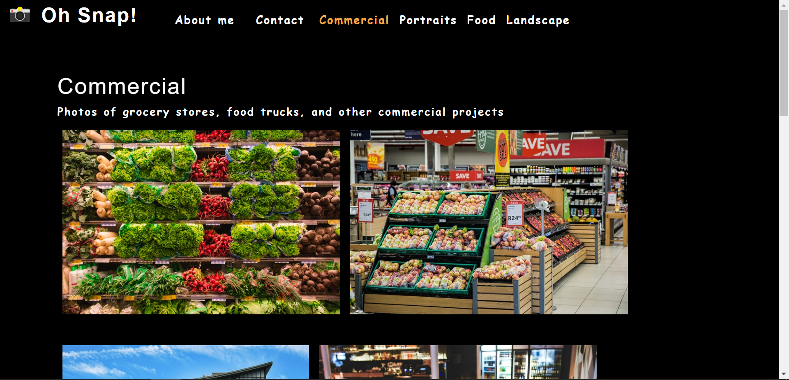

# Photo Port


## Description
This is a webpage for a hypothetical freelance photographer to display their works online. This webpage was made using React.js components so as to minimize the amount of code needed through the use of components.

## Technologies
* HTML
* CSS
* Javascript
* React.js

## Usage

Run the following command to install necessary dependencies
```
npm i
```
Run the following command to start local server on your device
```
npm start
```
Your default browser should automatically open to 'localhost:3000' where the webpage can be found! Alternatively, the link to the live webpage can be found below.

## Link

https://jespi116.github.io/photo-port/#about

## Screenshot


## License

This project is licensed under the MIT license.

## Questions:

If you have any questions about the repo, open an issue or contact me directly at Jespi116@fiu.edu. you can find more of my work at [Jespi116](https://github.com/Jespi116)
